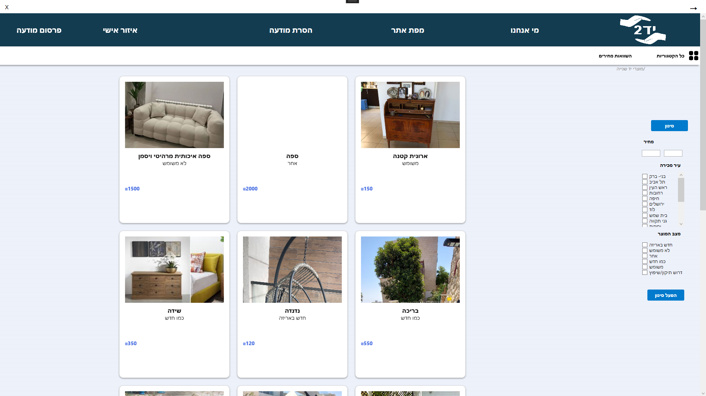

# MarketplaceAppWPF 

MarketplaceAppWPF is a high-performance WPF application built in C#. It offers a scalable platform for second-hand marketplaces, featuring robust user management, dynamic ad banners, and secure data handling with SQLExpress. Fully optimized for production and ready for deployment.

## Installation

### Prerequisites
- **Visual Studio 2022**: Make sure you have Visual Studio 2022 installed.
- **.NET 6 SDK**: Ensure that you have the .NET 6 SDK installed.
- **SQLExpress**: You need SQLExpress as the database engine.

### Steps to Install and Run

1. **Clone the Repository**
   - Open your terminal or Git Bash.
   - Navigate to the directory where you want to clone the project:
     ```bash
     cd path/to/your/directory
     ```
   - Clone the repository from GitHub:
     ```bash
     git clone https://github.com/hadas328/MarketplaceAppWPF.git
     cd MarketplaceAppWPF
     ```

2. **Restore NuGet Packages**
   - Open the solution file `HadasProject.sln` (Server) in Visual Studio 2022.
   - Visual Studio should automatically restore the necessary NuGet packages. If not, right-click on the solution in the Solution Explorer and select `Restore NuGet Packages`.
   - Repeat this step for the client solution (`opening.sln`) and the admin solution (`WpfApp2.sln`).

3. **Set Up the Database**
   - Open SQL Server Management Studio (SSMS) or your preferred SQL client.
   - Run the SQL script provided in the `Database` folder to create the necessary tables and seed data.
   - Update the connection string in `App.config` or `appsettings.json` in the server project to point to your local SQLExpress instance.

4. **Build the Solutions**
   - In Visual Studio, click `Build > Build Solution` or press `Ctrl + Shift + B` to compile each solution (`HadasProject.sln`, `opening.sln`, `WpfApp2.sln`).

5. **Run the Server Application**
   - Set the server project (`HadasProject.sln`) as the startup project in Visual Studio.
   - Press `F5` or click `Start` to run the server application. The server should now be running locally.

6. **Run the Client Application**
   - With the server running, set the client project (`opening.sln`) as the startup project and run it by pressing `F5`.
   - The client application should now be able to interact with the server.

7. **Run the Admin Application**
   - Similarly, set the admin project (`WpfApp2.sln`) as the startup project and run it by pressing `F5`.
   - The admin application should now be able to interact with the server.


## Usage

### For Users
Dear user, welcome to our second-hand marketplace system! Here, you can easily, quickly, and accessibly use the platform.

#### Available Functions:
- **Browse Products**: View a wide range of products available in the system, sorted by categories, subcategories, or new products. Each product includes detailed information.
- **Post a New Listing**: Register as a seller, optionally upload an image, and fill in the listing details (description, price, category, etc.).
- **Add to Favorites**: Add listings to your favorites list to revisit them later.
- **Contact Seller**: Directly contact the seller through the phone number listed in the ad.
- **Post Commercial Banners**: Upload banners for commercial advertising, choose the banner's placement on the site, and set the advertising period.
- **Remove All Listings**: Remove all your published listings by entering a unique user code.

#### Personal Area:
- **View and Update Profile**: View and update your user information.
- **View Ad History**: View all your published listings, including active and archived ads.
- **Edit and Delete Listings**: Edit or delete your published listings.
- **View Favorites List**: View and manage your favorite listings.
- **Track Banner Orders**: Track your commercial banner orders, including order status and advertising period.

### For Administrators
#### Available Functions:
- **Manage Users**: Edit and delete users, and manage their permissions and roles.
- **Manage Sellers**: Manage the permissions and roles of sellers, including editing and deleting sellers.
- **Manage Site Content**: Create, edit, and delete categories, subcategories, cities, and banner locations.
- **Manage Listings**: Approve, reject, and pause listings.
- **Manage Commercial Banner Orders**: Approve, reject, and pause banner orders.
- **Manage Payments**: Handle and process payments, including the ability to approve, reject, and execute credit card transactions.
- **View Active and Past Orders**: Monitor current and historical orders.
- **View Payments**: Review payment transactions.

To use the system effectively, please familiarize yourself with the graphical interface and carefully follow the instructions. We wish you a pleasant and efficient experience with our system!

##  Screenshots
### Admin Side
<p align="center">
  
  
  
</p>

### Client Side
<p align="center">
  
  
  
</p>
